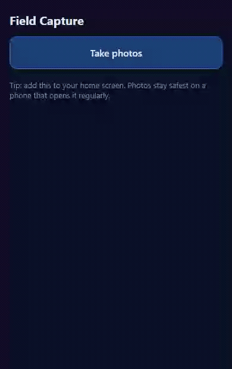
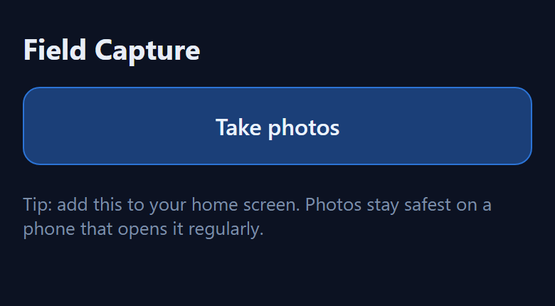
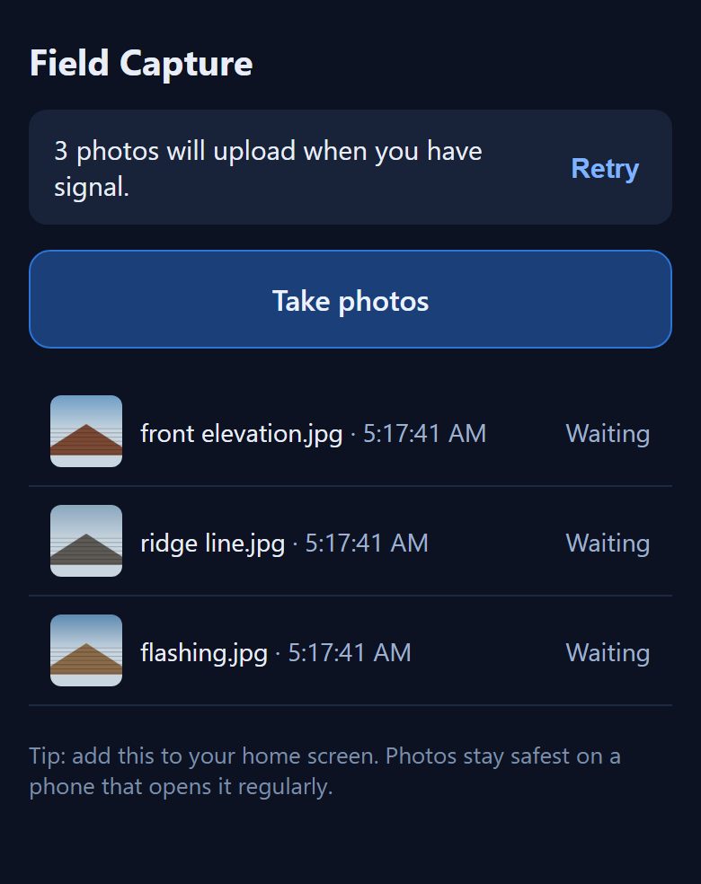
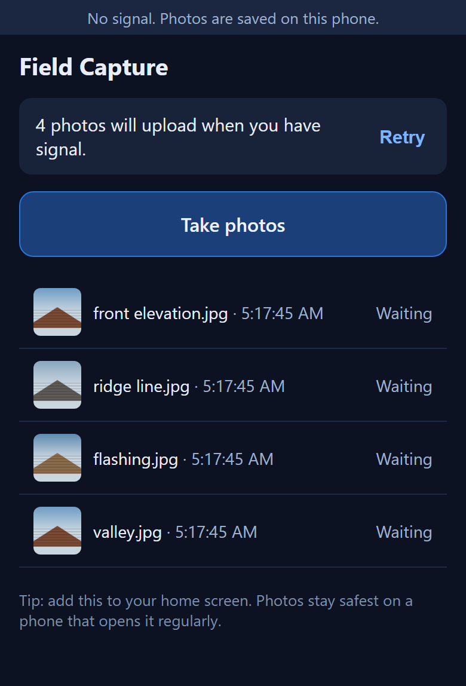
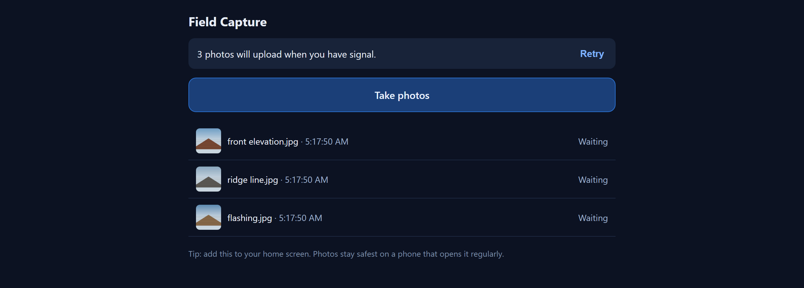

# GHL Tenant Bridge

A multi-tenant GoHighLevel to Supabase bridge with spherical storm-to-property matching,
keyless geocoding and county parcel lookup, and an offline-first field capture queue.

Built by driving the real APIs rather than reading about them. **Every number below was
measured on this machine, and where something is unimplemented it is listed as a gap
rather than glossed.**

- **12 test suites, ~284 assertions**, run against a real Postgres, a real browser and
  live third-party APIs.
- The suites that touch a live service run a **positive control before the negative
  test**, so a broken request cannot pass for a successful refusal.
- **Register, stated plainly:** this runs locally and is not deployed. Say "built,
  tested and running locally", never "in production". There are no real users.

---

## The offline queue, actually working

A roofer stands on a roof with no signal, takes four photos, and drives away. Nothing
may be lost, and nothing may be sent twice.



Left to right, that is one unedited recording: signal drops and the strip appears,
four photos queue locally while the count climbs, then signal returns and the queue
drains to empty on its own. The server received nothing during the offline stretch.

`tests/offline-drain.e2e.mjs` asserts exactly that, and checks the server's own counter
afterwards so "the queue emptied" cannot pass by the client simply forgetting:

```
PASS  offline strip shows when the connection drops
PASS  four photos captured with NO connection
PASS  all four are in the queue
PASS  the server received NOTHING while offline
PASS  the queue drained to empty after reconnecting
PASS  the server actually received the uploads      (9 POSTs, 15,568 bytes)
PASS  no orphaned photo bytes left on the device
```

| | |
|---|---|
|  |  |
| Nothing queued, so nothing is said. The quiet state is the absence of a badge, not a green tick. | Count plus action. Thumbnails are read back from device storage, so they survive a reload. |

### The state that matters



No signal, four photos held on the device, each one named and marked *Waiting*. The
strip is deliberately quiet: a thin line of muted text, not a red banner, because the
app is working exactly as intended and saying so loudly would be a lie about severity.

The same page at desktop width, since a field tool still gets opened on a laptop in an
office:



### Why the interface looks like this

The design came from reading real field apps, not from taste. **CompanyCam's actual
mobile UI** is a thin muted strip reading "You seem to be offline." and a calm grey card
reading "3 items waiting to upload." with a one-word action. The first draft here was a
red alert bar, which is precisely the documented **Housecall Pro** failure whose
persistent "OFFLINE Limited Functionality" banner false-fires on good signal and draws
review complaints.

So: **count plus action, never status plus colour**, and the card disappears at zero
(Encircle's decrementing-badge pattern). The copy says what will happen, because
web.dev's guidance is that non-technical audiences misread the word "offline".

Two more borrowed decisions. **Capture never blocks on a save** — Encircle earned a
3-star review for making users save one picture before taking the next. And **GPS and
time are stamped at capture, not at upload**, because the upload can be hours later.

Accessibility was checked against the spec rather than assumed. `role="status"` carries
an implicit `aria-live="polite"` and `aria-atomic="true"`, and MDN documents it as
**inappropriate for a frequently-updating counter** — every photo would fire a full
announcement. So the count is plain text and one polite region announces transitions
only. The queue is a plain list with real buttons, never a listbox holding buttons.

---

## The finding worth reading first

**HighLevel deprecates the legacy `X-WH-Signature` webhook header on 2026-09-01.** After
that date webhooks are signed only with `X-GHL-Signature` (Ed25519). Any integration
verifying just the legacy RSA header stops validating on that date, quietly.

This bridge is dual-path, prefers Ed25519, and **fails closed** on a legacy signature
presented after the sunset. `GET /api/webhooks/ghl` reports `daysUntilLegacySunset` so
the cutover is an ops number rather than a memory.

Source: [HighLevel Webhook Integration Guide](https://marketplace.gohighlevel.com/docs/webhook/WebhookIntegrationGuide/)

---

## What is in here

| Path | What it is |
|---|---|
| `src/app/capture/page.tsx` | The field capture surface. Downscales, stamps GPS at capture, queues locally. |
| `src/lib/outbox.ts` | The queue. UUIDv7 keys minted at capture, single-flight flush, proof-of-write guard. |
| `src/lib/outbox-storage-browser.ts` | OPFS for bytes, IndexedDB for metadata, with a fallback because Safari lacked `createWritable` until 26. |
| `src/lib/outbox-runtime.ts` | Registers the flush triggers. Page-driven, because iOS has no background path. |
| `src/lib/outbox-transport-supabase.ts` | Production transport. Derives the row count from a PostgREST `.select()`. |
| `src/lib/outbox-transport-http.ts` | Reference transport for a non-Supabase backend. |
| `supabase/migrations/0002_postgis.sql` | Spherical storm-to-property matching. Generated geography columns, GiST, `SECURITY INVOKER` so RLS applies. |
| `src/lib/geocode.ts` | US Census geocoding, keyless. Honest that it returns a block-face interpolation, not a rooftop. |
| `src/lib/parcels.ts` | County ArcGIS parcel lookup. Envelope-only, because a point query silently matches nothing. |
| `src/lib/ghl-signature.ts` | Dual Ed25519 / legacy-RSA verification, sunset-aware, fails closed. |
| `src/lib/ghl-oauth.ts` | OAuth install, rotating refresh, agency-to-location exchange. Proven live. |
| `src/lib/noaa.ts` / `src/lib/swdi.ts` | Live NWS alerts and historical hail via NCEI SWDI, both keyless. |
| `src/app/api/webhooks/ghl/route.ts` | The receiver: verify, replay window, tenant resolve, idempotency, apply, dead-letter. |
| `docs/INTEGRATION_CONTRACT.md` | Token classes, limits, failure matrix, known gaps. |
| `docs/DEMO_PORTABILITY.md` | What is free and permanent vs what expires or costs money. |

---

## Measured facts

Everything here was verified on this machine, not read in a doc.

### A bounding box is the wrong shape for a radius

Its corners reach about 1.41x the radius, so a property **67 km from a 50 km storm sits
inside the box**. SWDI only accepts a box, so the fetch uses one and the *match* uses
`ST_DWithin` over a generated `geography(Point,4326)` column with a GiST index. The box
stays in the repo as a **negative control**, so the over-selection is measured rather
than asserted.

### Postgres and PostGIS

- `geography` distances and the `ST_DWithin` tolerance are **metres**; `geometry(4326)`
  is **degrees**. Proven both directions.
- `ST_MakePoint` is **(longitude, latitude)**. The columns here are named
  latitude/longitude, so the natural typing order is the wrong one, and a swap produces
  plausible small numbers rather than an error.
- `ST_DWithin` carries `postgis_index_supportfn` and rewrites to `&& _st_expand(...)`.
  **`ST_Distance` carries none** and must never appear in a `WHERE` clause.
- **The RLS phantom.** An `INSERT` violating a `WITH CHECK` clause raises. An `UPDATE`
  or `DELETE` filtered by a `USING` clause **returns success with zero rows** — `UPDATE
  0`, no error, while the same statement on a visible row says `UPDATE 1`. So a client
  treating "it did not throw" as proof deletes its local copy of a record that was
  never stored. `RETURNING` is what makes it detectable. Re-runnable proof:
  `tests/rls_phantom_proof.sql`.
- Creating the `extensions` schema leaves it **without the usage grants** Supabase
  normally provides, which locks every RLS-scoped caller out of PostGIS. Found because
  the suite runs as `authenticated` rather than as owner.

### Geocoding and parcels

- The **Census geocoder** is keyless and returns a **block-face interpolation, not a
  rooftop** — the response carries a `tigerLine` id, a side of the street, and an
  address range. So the parcel lookup must buffer.
- A county ArcGIS **point query returns zero features and no error**, while the same
  coordinate as a ~20 m envelope returns several parcels. A point-in-polygon design
  reports "no parcel for this address" across an entire dataset with nothing to warn you.
- **A dead ArcGIS service answers HTTP 200** with `{"error":{"code":404}}` in the body,
  so the status line is not a health check.
- An unbounded query stops at **2000 rows** with only `exceededTransferLimit` to say so.

### Browsers and offline

- **Background Sync is supported in no version of Safari or iOS Safari**, and iOS has no
  Periodic Background Sync or Background Fetch either. Nothing runs after the app
  closes on the phones field crews carry, so the flush lives in the page.
- **`FileSystemFileHandle.createWritable()` requires Safari/iOS 26** (Chrome 86, Firefox
  111), while OPFS directories have existed in Safari for years. The obvious
  availability check therefore passes on an older iPhone and the write then throws. The
  adapter feature-detects on a real handle and falls back to IndexedDB, and reads
  consult **both** backends so bytes queued before a browser update are not declared
  missing.
- iOS evicts an origin's storage after seven days without interaction, taking IndexedDB,
  OPFS and the Cache API **together**. `navigator.storage.persist()` is the mitigation,
  it is requested on every mount, and its answer is surfaced rather than assumed.

### GoHighLevel

- **Target User and token class are independent axes.** A Sub-Account-target app
  installed from Agency View still returns a **Company** token with no `locationId`, so
  `/oauth/locationToken` is mandatory even there.
- **The workflow Custom Webhook action is unsigned.** Confirmed by capturing a real
  delivery: six headers, none a signature, and no `webhookId`, `timestamp` or
  `locationId` in the body. So no idempotency key and no replay window on that path,
  and it is a premium action. The Marketplace app subscription path is free,
  Ed25519-signed, retried 12 times and logged for 30 days.
- **There is no `FormSubmit` event** in the 58-event app catalogue, so form submissions
  must come through a workflow action, which is exactly the unsigned path.
- **Webhook subscription registration has no API at all** — all 83 official specs
  parsed: 852 paths, zero containing "hook". It is UI-only on both paths.
- Four distinct refusal messages mean four different things: missing scope, wrong token
  class on a PIT, right class but wrong tenant, and an OAuth Company token hitting a
  sub-account scope.
- Sandbox limits: **25 req/10s**, 10,000/day, per location, and a **2-location hard cap**
  per sandbox agency.

---

## Tests

```bash
sh tests/run_all.sh               # everything

node tests/signature.test.mjs      # 19  real crypto, both directions
node tests/workflow-auth.test.mjs  # 22  constant-time, downgrade guard
node tests/noaa.test.mjs           # 17  live NWS API
node tests/swdi.test.mjs           # 23  live SWDI, bbox proven both ways
node tests/geo.test.mjs            # 31  live Census + live county parcels
node tests/outbox.test.mjs         # 56  state machine, all deps injected
node tests/outbox.browser.mjs      # 33  real Chromium, survives a reload
node tests/offline-drain.e2e.mjs   # 10  offline capture -> reconnect -> empty
python tests/postgis.test.py        # 25  real migrations on real Postgres
python tests/verify_public_keys.py  #     shipped keys == HighLevel's published keys
python tests/tenant_isolation.py    #     live GHL cross-tenant isolation, with a control
python tests/verify_oauth_claims.py # 17  decodes the JWTs, re-runs isolation
```

Four suites need something a fresh clone may not have and **skip loudly** rather than
failing: `verify_oauth_claims.py` needs the gitignored token files, `postgis.test.py`
needs a local `pgis` container, `outbox.browser.mjs` needs Playwright, and
`offline-drain.e2e.mjs` needs a running server.

**A green test proves nothing until it has been watched go red for the right reason.**
Reverting the coordinate order in `0002_postgis.sql` produces 5 failures, including the
40 km property collapsing to 4.75 km.

Some tests exist because of a specific mistake:

- `verify_public_keys.py` exists because the RSA key body was **fabricated** in a first
  draft. A wrong public key does not crash; it silently fails every verification, so
  the shipped artifact is diffed against the scraped published key.
- `tenant_isolation.py` runs a **positive control first**: tenant A writes and reads
  back its own contact, proving the harness works, and only then is tenant B refused.
  Without it, a broken request would "prove" isolation by failing for the wrong reason.
- `outbox.browser.mjs` **forces the IndexedDB backend**, because Chromium supports
  `createWritable` and would otherwise leave that whole path unexecuted — and that is
  the path most iPhones will actually use.

---

## Running it

```bash
npm install
cp .env.example .env.local          # then fill in

# apply the schema to any Postgres 17 with PostGIS available
psql "$SUPABASE_DB_URL" -f supabase/migrations/0001_schema.sql
psql "$SUPABASE_DB_URL" -f supabase/migrations/0002_postgis.sql

npm run build
DEMO_SINK=1 npm start               # http://localhost:3000/capture
```

Required env: `NEXT_PUBLIC_SUPABASE_URL`, `NEXT_PUBLIC_SUPABASE_ANON_KEY`,
`SUPABASE_SERVICE_ROLE_KEY`, and `NWS_USER_AGENT` (NWS returns **403** on an empty
User-Agent, measured).

`DEMO_SINK=1` enables `/api/demo/queue`, a local no-op sink so the queue can drain
without Supabase credentials. It refuses to run in production unless explicitly set, so
it cannot become an accidental open upload endpoint. With Supabase configured, swap the
capture page's transport for `createSupabaseOutboxTransport`.

### Local Postgres for the PostGIS suite

```bash
docker run --rm -d --name pgis -e POSTGRES_PASSWORD=pw -p 55432:5432 postgis/postgis:17-3.5
python tests/postgis.test.py
```

`tests/supabase_shim.sql` stands in for the `auth` schema and Supabase's default
privileges so RLS can be **exercised** locally. It is a test harness and says so; it
validates policy logic, not Supabase's permission model.

---

## Known gaps

Listed because a README that only lists strengths is not information.

- **Not deployed.** It runs locally. No hosted instance, no users.
- **iOS is documentation, not measurement.** The browser suite is Chromium on Windows.
  It proves the adapter is correct against the standard APIs; the seven-day eviction and
  the smaller iOS quota are cited from WebKit's own docs and have not been reproduced on
  a device here.
- **Webhook subscription registration is UI-only** on both paths, by the vendor's
  design. Both paths are handled in code; neither can be created via API.
- **No live authenticated write to a customer's production account.** The sandbox work
  is real; a production write is not claimed.
- **The workflow path is unsigned** and cannot be made otherwise. Prefer Marketplace app
  webhooks, which are free, signed, retried and logged.
- **Roof geometry is not solved here.** Ridge, hip and valley measurement has no free
  and legal source; the honest routes are per-report vendors or a lidar pipeline that
  nobody has published.
- **Google imagery is off-limits** for this shape of product: its terms forbid tracing
  or digitising building outlines, forbid training models on it, and forbid mixing it
  with a non-Google basemap.

---

## Free vs paid, and why it matters for reuse

**The Marketplace app webhook path is the primary path, deliberately.** It is free,
Ed25519-signed, retried 12 times with backoff, and carries 30 days of delivery logs.

The workflow "Custom Webhook" action is a **premium** action and is used only as a
fallback for form submissions, which have no event in the catalogue.

Geocoding and parcels are keyless and free. The sandbox runs on trial access to
Enterprise features and expires about six months after creation, so nothing
load-bearing is built on it: most suites need no GHL account at all. Full
classification in `docs/DEMO_PORTABILITY.md`.
